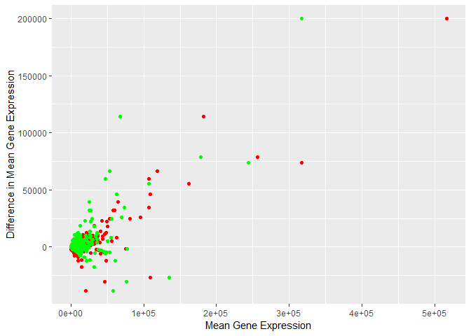

Fun time tracking stuff because I'm a nerd (and I thought you might find
it useful): DataCamp = 2h55min; Questions 2-8: 2h53min. How symetrical!

Question 2:

    setwd("C:/Users/garre/Documents/GitHub/Bio720/assignments")
    rnaCounts = read.csv("rna_counts.csv", header=T, row.names = 1)
    colMean = function(column, logThis = F){
      if (logThis == T){
        column = log2(column)
      }
      condition = is.finite(column)
      mean(column[condition])
    }
    c(colMean(rnaCounts[,1]),colMean(rnaCounts[,2]))

    ## [1] 1978.847 1983.250

    colMean(rnaCounts[,1], logThis=T)

    ## [1] 9.033518

Question 3:

    everyMean = double(ncol(rnaCounts))
    for (i in seq_along(rnaCounts)){
      everyMean[i] = colMean(rnaCounts[,i])
      names(everyMean)[i] = colnames(rnaCounts)[i]
    }
    everyMean

    ##  F101_lg_female_hdhorn F101_lg_female_thxhorn   F101_lg_female_wings 
    ##               1978.847               1983.250               1583.904 
    ##  F105_lg_female_hdhorn F105_lg_female_thxhorn   F105_lg_female_wings 
    ##               2105.712               1433.749               1869.962 
    ##  F131_lg_female_hdhorn F131_lg_female_thxhorn   F131_lg_female_wings 
    ##               2117.847               2307.529               2272.692 
    ##   F135_sm_female_wings  F135_sm_female_hdhorn F135_sm_female_thxhorn 
    ##               1728.483               1452.913               1776.309 
    ##  F136_sm_female_hdhorn F136_sm_female_thxhorn   F136_sm_female_wings 
    ##               2065.780               1777.769               1988.882 
    ##  F196_sm_female_hdhorn F196_sm_female_thxhorn   F196_sm_female_wings 
    ##               1348.898               1025.301               3067.287 
    ##  F197_sm_female_hdhorn F197_sm_female_thxhorn   F197_sm_female_wings 
    ##               2639.152               2047.151               2081.889 
    ##  F218_lg_female_hdhorn F218_lg_female_thxhorn   F218_lg_female_wings 
    ##               2329.563               1950.561               2074.992 
    ## M120_sm_male_genitalia    M120_sm_male_hdhorn   M120_sm_male_thxhorn 
    ##               1832.780               2105.145               2101.163 
    ##     M120_sm_male_wings M125_lg_male_genitalia    M125_lg_male_hdhorn 
    ##               2536.920               2088.092               2372.259 
    ##     M125_lg_male_wings M160_lg_male_genitalia    M160_lg_male_hdhorn 
    ##               2559.085               1727.538               2111.337 
    ##   M160_lg_male_thxhorn     M160_lg_male_wings M171_sm_male_genitalia 
    ##               2087.583               2184.076               2035.093 
    ##    M171_sm_male_hdhorn   M171_sm_male_thxhorn     M171_sm_male_wings 
    ##               1598.190               1621.659               1825.344 
    ## M172_sm_male_genitalia    M172_sm_male_hdhorn   M172_sm_male_thxhorn 
    ##               2196.101               1713.119               1344.019 
    ##     M172_sm_male_wings M180_lg_male_genitalia    M180_lg_male_hdhorn 
    ##               2602.351               1922.634               2670.498 
    ##   M180_lg_male_thxhorn     M180_lg_male_wings M200_sm_male_genitalia 
    ##               2003.293               3216.476               2412.038 
    ##    M200_sm_male_hdhorn   M200_sm_male_thxhorn     M200_sm_male_wings 
    ##               2032.085               2820.495               2203.813 
    ## M257_lg_male_genitalia    M257_lg_male_hdhorn   M257_lg_male_thxhorn 
    ##               2170.258               2361.912               2749.767 
    ##     M257_lg_male_wings 
    ##               1325.684

I noticed that the wings had the most RNA counts on average

Question 4:

    everyMean = double(ncol(rnaCounts))
    everyMean = sapply(rnaCounts, colMean,logThis=T)

    system.time(sapply(rnaCounts, colMean))[3]

    ## elapsed 
    ##    0.02

    system.time(for (i in seq_along(rnaCounts)){
      everyMean[i] = colMean(rnaCounts[,i])
      names(everyMean)[i] = colnames(rnaCounts)[i]})[3]

    ## elapsed 
    ##       0

lapply was 0 elapsed time and the for loop had a longer time at 0.02

Question 5:

    geneMeans= colMeans(rnaCounts)

Question 6:

    geneMeans = rowMeans(rnaCounts)

Question 7:

    myColumns = colnames(rnaCounts)
    myColumns = strsplit(myColumns, split = "_")

    justMaleHeads = function(x,arg2 = NA){
      y = x[3]=="male"&&x[4]=="hdhorn"
      if (is.na(arg2)==F){
        y = y&&x[2]==arg2
      }
      y
    }
    rc2 = rnaCounts[sapply(myColumns,justMaleHeads)]
    geneMeans =rowMeans(rc2)
    lg = rowMeans(rnaCounts[sapply(myColumns, justMaleHeads, arg2="lg")])
    sm = rowMeans(rnaCounts[sapply(myColumns, justMaleHeads, arg2="sm")])
    meanDiff = lg-sm

Question 8:

    library(ggplot2)

    df = data.frame(meanDiff,lg,sm)
    ggplot(df, aes(y=meanDiff)) + geom_point(aes(x=lg), color="red") + geom_point(aes(x=sm), color = "green") +labs(x ="Mean Gene Expression", y = "Difference in Mean Gene Expression")

    rnaLog = rnaCounts + 0.1
    rnaLog = log2(rnaLog)
    lg = rowMeans(rnaLog[sapply(myColumns, justMaleHeads, arg2="lg")])
    sm = rowMeans(rnaLog[sapply(myColumns, justMaleHeads, arg2="sm")])
    meanDiff = lg-sm

    df = data.frame(meanDiff,lg,sm)
    ggplot(df, aes(y=meanDiff)) + geom_point(aes(x=lg), color="red") + geom_point(aes(x=sm), color = "green") +labs(x ="Mean Gene Expression", y = "Difference in Mean Gene Expression")

